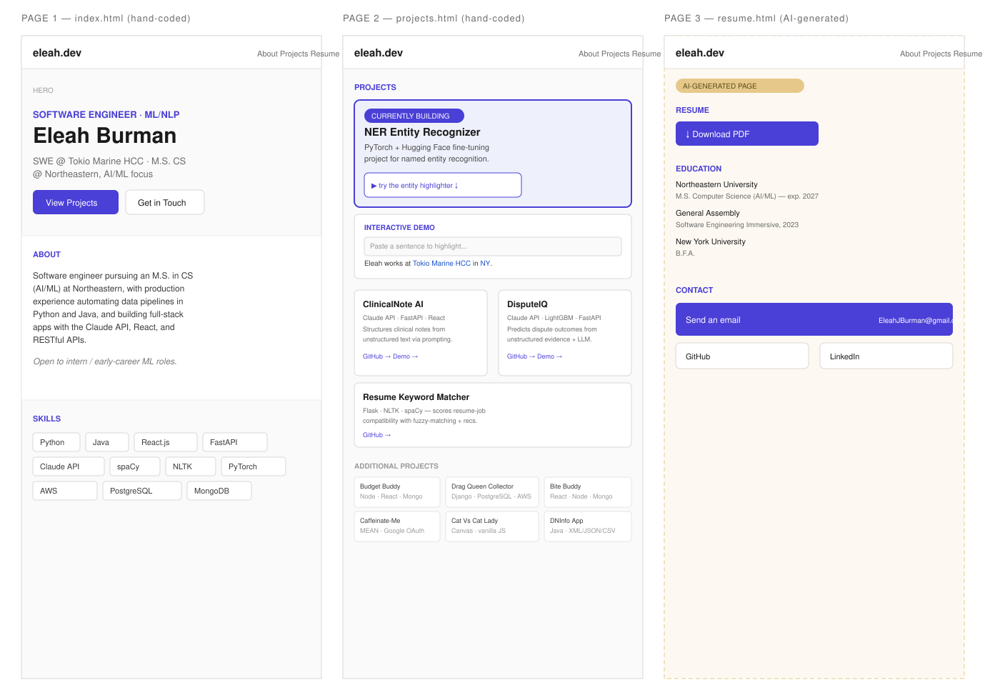

# Eleah Burman — Personal Homepage (Project 1)

## Author
Eleah Burman

## Class Link
CS5610 Web Development — Northeastern University, taught by John Alexis Guerra Gómez
TODO: add the course site/syllabus link here

## Project Objective
A personal, tech-forward portfolio homepage built with vanilla HTML5, CSS3, and ES6 modules — no frameworks, no backend. The site targets recruiters and hiring managers in ML/NLP and software engineering, presenting my background, real projects, and an interactive JavaScript demo that reflects the NLP work I actually build.

## Screenshot
TODO: add a screenshot of the deployed site once index.html/projects.html/resume.html are built and live (this is the final-site screenshot the rubric asks for — separate from the design mockup below).

## Instructions to Build
```bash
git clone https://github.com/EleahBurman/eleah-burman-project-1.git
cd eleah-burman-project-1
npm install
```
Open `index.html` in a browser, or serve locally with a static server of your choice.
TODO: update this once you know your actual deploy/run steps (e.g. live-server, GitHub Pages).

---

## Design Document

### Project description
A tech-forward personal homepage supporting my Summer 2027 internship and full-time SWE/ML search. The site presents my background (Northeastern M.S. CS, current SWE role at Tokio Marine HCC, B.F.A. from NYU) and real technical projects to recruiters and hiring managers at quant firms, AI labs, and tech companies. Built with vanilla HTML5/CSS3/ES6+, deployed publicly, with an interactive JS feature (an entity highlighter) that echoes my in-progress NER fine-tuning project.

### User Personas

**1. Amelia, Technical Recruiter at an AI Lab**
Looks through a many portfolios per day and usually spends less than 90 seconds on each one. She wants to quickly see relevant coursework, projects, and contact information.

**2. Mark, Engineering Manager at a Quant Trading Firm**
Cares more about the actual work than flashy design. He wants clear project descriptions, the technologies used, links to the code, and a resume.

**3. Brad, Fellow Northeastern Student / Networking Contact**
Found the site through class or LinkedIn. Wants to see what Eleah is currently working on and potentially connect or collaborate.

### User Stories
- As a technical recruiter, I want to see Eleah's current role and the types of positions she's looking for right away, so I can quickly decide if she's a potential fit.
- As a hiring manager, I want to click on a project and see what technologies were used and a link to the repository, so I can get a better idea of her experience.
- As a mobile visitor, I want the website to work well on my phone, so I can easily look through it without the layout being difficult to use.
- As a recruiter, I want to be able to download Eleah's resume, so I don't have to contact her just to ask for it.
- As a networking contact, I want to see what Eleah is currently working on, so I have an idea of what to talk to her about.

### Design mockups
Site map — 3 pages:
- `index.html` (hand-coded) — hero, about, skills
- `projects.html` (hand-coded) — featured projects, currently-building NER project, interactive entity-highlighter demo
- `resume.html` (AI-generated, see below) — resume download, education, contact



---

## Use of GenAI

The `resume.html` page (Resume, Education, and Contact sections) was built using **Claude** (Anthropic), accessed via claude.ai. The other two pages (`index.html`, `projects.html`) were hand-coded without AI assistance, and were used as style/context reference before generating `resume.html`.

**Prompt used:**

> Build `resume.html` for a personal portfolio site, matching the existing visual system used in `index.html` and `projects.html`: CSS variables for colors (`--color-bg: #FBFAF7`, `--color-surface: #FAFAFA`, `--color-ink: #1B1D22`, `--color-accent: #3730A6`, `--color-accent-2: #0F6E56`, `--color-accent-3: #B8860B`), fonts (`Newsreader` serif for body/headings, `JetBrains Mono` for tags/labels/nav), the same header/nav structure, and the small-uppercase-indigo `.page-title` label style used on the Projects page. Single-column stacked layout, left-aligned, matching the rest of the site — no side-by-side columns. The page needs three sections: (1) a Resume section with a download link/button to a PDF resume, (2) an Education section listing three degrees — Northeastern University M.S. Computer Science (AI/ML focus), expected June 2027; General Assembly Software Engineering Immersive (450+ hrs), June 2023; New York University B.F.A. — and (3) a Contact section with an email link, GitHub link, and LinkedIn link. Use semantic HTML5, proper heading hierarchy (this page's own `<h1>` should be "Resume"), and reuse existing class names/patterns from the other two pages wherever the same visual pattern applies (e.g. `.btn-primary` for the download button).

The generated HTML was reviewed line by line and then iterated on directly — including converting the Education section into a clickable horizontal timeline linking to each institution's website, and fixing spacing/alignment issues that came up during review.

**What went well:** the generated HTML correctly reused existing class names (`.page-title`, `.btn-primary`, `.card-title`, `.description`) instead of inventing new ones, matched the semantic structure and heading hierarchy of the other two pages, and got the overall three-section layout right on the first pass.

**What didn't go well:** the initial CSS for the page had a layout bug — `.page-title` retained leftover horizontal padding meant for a different context, which combined with the section's own padding to visually misalign the section titles from the buttons/content beneath them. This wasn't caught until reviewing the rendered page, not from reading the code alone, which reinforced why visual review matters even when the code looks correct on paper.

**What was changed after generation:** after reviewing the plain bulleted Education list, I decided it under-used the fact that all three entries are chronological — so I redesigned it into a horizontal, clickable timeline (each entry links to the institution's website), which the AI's original output did not include and wasn't part of the original prompt. The padding/alignment bug above was also fixed manually, and one factual correction was made (NYU's B.F.A. date, June 2013, wasn't in the original prompt and was added afterward).

## License
MIT — see [LICENSE](./LICENSE)